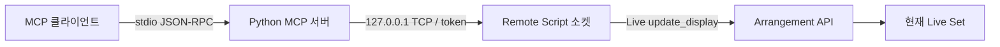

# 다른 프로젝트에서 재사용

## 구성



| 경로 | 책임 |
| --- | --- |
| `src/ableton_arrangement_mcp/server.py` | 타입·입력 스키마·MCP 도구·stdio 실행 |
| `src/ableton_arrangement_mcp/client.py` | 로컬 TCP 요청·응답·제한 시간·오류 |
| `remote_script/AbletonArrangementMCP/api.py` | Arrangement 대상 확인, 검증, Live API 호출 |
| `remote_script/AbletonArrangementMCP/timeline.py` | 타임라인 편집 준비·native 가장자리 트림·마커 리사이즈·복구본 관리 |
| `remote_script/AbletonArrangementMCP/transport.py` | 인증·프레임 처리·중복 ID·nonblocking 소켓 |
| `remote_script/AbletonArrangementMCP/surface.py` | Live 진입, main-thread callback, 종료 |
| `src/ableton_arrangement_mcp/installer.py` (`scripts/configure.py`에서 호출) | 설정 생성, 명시한 User Library 설치, 업데이트 백업 |
| `scripts/export_conversation.py` | 지정한 세션의 공개 대화 메시지를 `doc/conversations/`에 복사 |
| `tests/` | 가짜 Live 모델, 실제 TCP·MCP 통합 검증 |

이 경로들은 프로젝트 루트 기준입니다. wheel에는 서버와 통합 Live Script가 모두
포함됩니다. `pip install .` 또는 Git URL 설치 후 `abletonctrl-install`로
User Library에 배치합니다. 소스를 재사용할 때에는 MIT LICENSE와 원본 출처를 보존하세요.

`compatibility.py`는 원본 도구의 입력·반환 형식을 보존하고 `upstream.` 명령으로
인증 bridge에 연결합니다. `upstream/`의 원본 서버 코드는 별도 MCP나 소켓을 실행하지
않습니다. `surface.py`는 원본 Live handler를 상속하되 원본 네트워크 생성자를 호출하지
않고, 주 스레드에서 읽기·쓰기를 모두 실행합니다. 원본의 schedule_message(0) 후
큐 대기는 같은 주 스레드에서 즉시 실행해 교착을 피합니다.

원본 파일 목록·SHA256은 [upstream-source.json](upstream-source.json)에 있습니다.
원본 갱신 시 tool schema 비교와 old/new 통합 테스트를 먼저 실행하세요.
`upstream/config.py`는 이 프로젝트가 추가한 선택적 backend 설정이며 원본 파일이 아닙니다.

가상환경·캐시·인증 토큰·기존 대화 로그는 재사용 코드에 포함할 필요가 없습니다.
Live 안에 MCP/Pydantic 의존성을 넣지 마세요. 내부 브리지는 표준 라이브러리만
사용하며 Python 3.7 문법과 호환되도록 작성했습니다. 이는 Live 런타임 검증을
대신하지 않습니다. 외부 MCP 서버는 Python 3.10 이상입니다.

macOS도 Python/소켓 코드 구조는 동일합니다. `.venv/bin/python`으로 외부 서버를
실행하고, 실제 User Library를 `--user-library`로 지정하면 됩니다. macOS 설치와
Live 내부 동작은 이번 작업에서 검증하지 않았습니다.

## MCP 없이 호출하기

외부 Python 프로그램에서 다음처럼 기존 client를 직접 사용할 수 있습니다.
별도의 AI나 OpenAI API 연결은 필요하지 않습니다.

```python
from ableton_arrangement_mcp.client import BridgeClient

client = BridgeClient.from_file(r"Z:\Work\WorkAI\AbletonCtrl\doc\local\bridge.json")
status = client.call("status")
tracks = client.call("list_tracks", {"offset": 0, "limit": 100})
track_id = tracks["tracks"][0]["track_id"]
clips = client.call("list_clips", {"track_id": track_id})
```

## TCP 계약

이 TCP 서버는 MCP 서버 자체가 아니라 내부 브리지입니다. 연결당 한 요청과 한 응답을
UTF-8 JSON + LF로 교환하고 연결을 닫습니다. 호스트는 `127.0.0.1`로 고정합니다.

```json
{"id":"매 요청마다 새로운 UUID", "token":"로컬 설정의 토큰", "deadline":1790000000.0,
 "method":"list_tracks", "params":{"offset":0,"limit":100}}
```

`deadline` 예시 값은 실제 호출에 재사용하지 말고 `time.time() + 8`처럼 계산합니다.
최대 15초 이내의 Unix 시각이어야 합니다. 메서드 이름은 `api.py`의 `METHODS` 및 `surface.py`의 `UPSTREAM_COMMANDS` 목록에
제한됩니다. 후자는 `upstream.` 접두어를 붙입니다. 임의 Python 실행이나 객체 메서드 호출은 제공하지 않습니다.

```json
{"id":"요청과 동일", "result":{"tracks":[],"total":0,"offset":0}}
```

```json
{"id":"요청과 동일", "error":{"code":"STALE_HANDLE","message":"..."}}
```

프레임은 최대 16 MiB, 동시 소켓은 8개입니다. tick당 소켓별 수신·송신은 각각 최대
256 KiB입니다. 오래된 연결은 15초 뒤 닫습니다. 최근 2,048개 처리 ID만 기억하므로
영구적인 exactly-once 보장은 없습니다. 클라이언트는 원래부터 자동 재시도하지 않습니다.
시간이 만료된 요청은 Live API 호출 직전에 거부됩니다. 호출 후 응답 손실은 처리
완료 여부를 보장할 수 없으므로 새 조회로 상태를 확인해야 합니다.

읽기 작업도 반드시 Live main thread에서 실행합니다. 네트워크 스레드에서 Live
객체를 직접 접근하도록 변경하면 안 됩니다. 이 구조는 소켓 대기를 막지 않지만
단일 Live API 호출 자체가 오래 걸리는 것을 선점할 수는 없습니다.

## 기능 확장 순서

1. 공식 LOM과 해당 Live 버전에서 지원되는 Python 메서드·시그니처를 확인합니다.
2. `api.py`에 명시적 메서드를 추가하고 `METHODS` 허용 목록에 등록합니다.
3. 입력을 모두 확인한 뒤 `_mutate()` 안에서 필요한 Live 호출만 실행합니다.
4. MCP 도구의 스키마·설명·readOnly/destructive/idempotent annotation을 추가합니다.
5. 가짜 API 테스트와 실제 stdio 통합 테스트를 확장하고 별도 Live Set에서 검증합니다.

현재 이동은 복사본의 위치·길이·종류 확인 후 원본을 지우는 방식입니다. 원본 삭제
실패 시 PARTIAL_MOVE로 두 ID를 보고하며 자동 Undo/재시도하지 않습니다. 실제
클립 자동화·루프·오디오 내용 보존 여부는 Live 수동 검증 대상입니다. `start_time`이나
`end_time`에 직접 쓰지 않습니다. 오디오 import는 Live PC의 절대 파일 경로를 받고,
길이가 사전에 확정되지 않으므로 트랙 마지막 클립 이후만 허용합니다.

클라이언트 기본 응답 제한 시간은 10초, 오디오·일부 브라우저/스냅샷은 70초,
타임라인 트리밍·리사이즈는 120초입니다.
요청의 deadline은 **실행 시작 허용 시각**이며 작업 자체를 중단하는 시간이 아닙니다.
긴 Live 호출 뒤 응답을 보낼 시간을 새로 부여합니다. 원본 복합 도구는 여러 bridge
명령을 실행할 수 있으므로 MCP 클라이언트에는 180초 제한을 권장합니다.

`TimelineEditor`는 `ArrangementAPI`의 `_space`, `_editable`, `_snapshot`, `_mutate`
계약을 사용합니다. 다른 프로젝트에 옮길 때 `api.py`, `timeline.py`와 `silence_path`
주입도 함께 유지해야 합니다. 오디오 보조 파일은 installer의 `write_silence`로 생성하며
원본 음원을 재직렬화하지 않습니다. copy는 목적 트랙의 native duplicate를 호출합니다.
trim/resize 결과는 단일 snapshot 대신 `clips[]`이므로 호출자는 모든 결과를 처리해야
합니다. [동작·알려진 한계·복구](timeline-editing.md)를 함께 배포하세요.

## 대화와 메모리 기록

작업 종료 시 `doc/PROJECT_MEMORY.md`, `doc/progress.md`, 해당 날짜 대화 기록을
갱신합니다. 전체 공개 메시지 복사는 다음 도우미를 사용합니다.

```powershell
.venv\Scripts\python scripts\export_conversation.py --session 'C:\경로\해당-session.jsonl'
```

정확히 지정한 파일의 `response_item` 중 user/assistant 텍스트만 복사합니다. 숨겨진
분석, system/developer 메시지, 도구 원본 출력은 내보내지 않습니다. 도구 조사 결과는
`research.md`와 `verification.md`에 남깁니다. 앱의 원본 로그는 이동·삭제하지 않습니다.
진행 중 로그의 마지막 미완성 줄은 건너뛰므로 종료 후 다시 실행하면 추가 메시지를
반영할 수 있습니다. 공개 메시지에 사용자가 직접 쓴 민감정보까지 자동 익명화하는
기능은 없으므로 대화 파일은 공유 전에 검토하세요.
